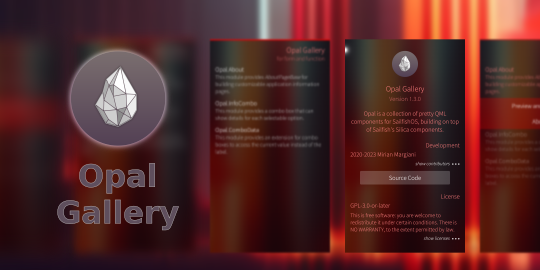

<!--
SPDX-FileCopyrightText: 2018-2025 Mirian Margiani
SPDX-License-Identifier: GFDL-1.3-or-later
-->

# Opal Gallery for Sailfish OS

Opal is a collection of pretty QML components for SailfishOS, building on top
of Sailfish's Silica components.

This repository contains the Opal Gallery application which showcases all
modules.
The module examples can be used as a starting point for new applications.

You can find documentation on how to use Opal in other applications
[in the main repo](https://github.com/Pretty-SFOS/opal). If you want to use
applications using Opal, you should not have to do anything.

## Development

1. Clone this repository e.g. to `src/opal/opal`
2. Run [fetch-modules.sh](fetch-modules.sh) to fetch the latest module sources, clone required
   module repositories as requested
3. Open the project file [harbour-opal-gallery.pro](harbour-opal-gallery.pro) in the Sailfish OS IDE
4. Build an RPM package and install it on the target device

### Adding new modules

Please refer to [the main repo](https://github.com/Pretty-SFOS/opal) for
documentation on how to setup new modules.

Module metadata and examples live in the respective repositories. After the new
module is properly prepared, register it in [fetch-modules.sh](fetch-modules.sh).
Run the script to include the new module in Opal Gallery.

## Help and support

You are welcome to [leave a comment in the forum](https://forum.sailfishos.org/t/opal-qml-components-for-app-development/15801)
if you have any questions or ideas.

## Translations

It would be wonderful if the app could be translated in as many languages as possible!

Translations are managed using
[Weblate](https://hosted.weblate.org/projects/opal/opal-gallery).
Please prefer this over pull request (which are still welcome, of course).
If you just found a minor problem, you can also
[leave a comment in the forum](https://forum.sailfishos.org/t/opal-qml-components-for-app-development/15801)
or [open an issue](https://github.com/Pretty-SFOS/opal-gallery/issues/new).

Please include the following details:

1. the language you were using
2. where you found the error
3. the incorrect text
4. the correct translation

### Manually updating translations

Please prefer using
[Weblate](https://hosted.weblate.org/projects/opal) over this.
You can follow these steps to manually add or update a translation:

1. *If it did not exist before*, create a new catalog for your language by copying the
   base file [translations/harbour-opal-gallery.ts](translations/harbour-opal-gallery.ts).
   Then add the new translation to [harbour-opal-gallery.pro](harbour-opal-gallery.pro).
2. Add yourself to the list of translators in [TRANSLATORS.json](TRANSLATORS.json),
   in the section `extra`.
3. (optional) Translate the app's name in [harbour-opal-gallery.desktop](harbour-opal-gallery.desktop)
   if there is a (short) native term for it in your language.

See [the Qt documentation](https://doc.qt.io/qt-5/qml-qtqml-date.html#details) for
details on how to translate date formats to your *local* format.

## Building and contributing

*Bug reports, and contributions for translations, bug fixes, or new features are always welcome!*

1. Clone the repository by running `git clone https://github.com/Pretty-SFOS/opal-gallery.git`
2. Open `harbour-opal-gallery.pro` in Sailfish OS IDE (Qt Creator for Sailfish)
3. To run on emulator, select the `i486` target and press the run button
4. To build for the device, select the `aarch64` or `armv7hl` target and click “deploy all”;
   the RPM packages will be in the `RPMS` folder

If you contribute, please do not forget to add yourself to the list of
contributors in [qml/pages/AboutOpalPage.qml](qml/pages/AboutOpalPage.qml)!

## Gallery app permissions

- Videos and MediaIndexing: to showcase the media player module `Opal.MediaPlayer`
- Internet: to showcase link previews in `Opal.LinkHandler`, and license text downloads in `Opal.About`

All network access requires explicit user interaction.

## Module licensing

All Opal [modules](https://github.com/Pretty-SFOS/opal/blob/main/README.md) have
their own licensing. You can find more information about each module by opening
their “About” pages in the Gallery app, or simply refer to the respective
repositories.

All documentation is released under the terms of the
[GFDL-1.3-or-later](https://spdx.org/licenses/GFDL-1.3-or-later.html).

> Permission is granted to copy, distribute and/or modify this document
> under the terms of the GNU Free Documentation License, Version 1.3
> or any later version published by the Free Software Foundation;
> with the Invariant Sections being \[none yet\], with the Front-Cover Texts
> being \[none yet\], and with the Back-Cover Texts being \[none yet\].
> You should have received a copy of the GNU Free Documentation License
> along with this document.  If not, see <http://www.gnu.org/licenses/>.

## Donations

If you want to support my work, I am always happy if you buy me a cup of coffee
through [Liberapay](https://liberapay.com/ichthyosaurus).

Of course it would be much appreciated as well if you support this project by
contributing to translations or code! See above how you can contribute 🎕.

## Anti-AI policy <a id='ai-policy'/>

AI-generated contributions are forbidden.

Please be transparent, respect the Free Software community, and adhere to the
licenses. This is a welcoming place for human creativity and diversity, but
AI-generated slop is going against these values.

Apart from all the ethical, moral, legal, environmental, social, and technical
reasons against AI, I also simply don't have any spare time to review
AI-generated contributions.

## License

> Copyright (C) 2021-2025  Mirian Margiani

Opal Gallery is Free Software released under the terms of the
[GNU General Public License v3 (or later)](https://spdx.org/licenses/GPL-3.0-or-later.html).
The source code is available [on Github](https://github.com/Pretty-SFOS/opal-gallery).
All documentation is released under the terms of the
[GNU Free Documentation License v1.3 (or later)](https://spdx.org/licenses/GFDL-1.3-or-later.html).

This project follows the [REUSE specification](https://api.reuse.software/info/github.com/Pretty-SFOS/opal-gallery).
